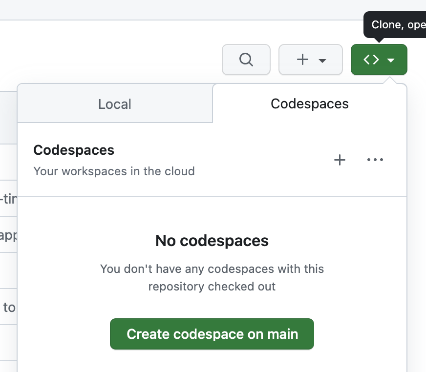

# Codespace での構築手順

## Requirements

以下がインストール済みであること。

- Codespaces 対応ブラウザ（Chromium 系、firefox、safari）
- VSCode で執筆する場合のみ
  - VSCode 拡張機能 [Remote Development](https://marketplace.visualstudio.com/items?itemName=ms-vscode-remote.vscode-remote-extensionpack)
  - VSCode で GitHub アカウントにログインしておくこと
    - VSCode サイドバーのアイコンからログインできる

## 手順

- 作成した作業用リポジトリで Codespace を作成する

  - `<>` ボタン > `Codespaces` タブ > `＋` ボタン押下

    

  - codespace 用のウィンドウが開かれ、ビルドが始まる
  - ビルドが完了すると、ブラウザ上で VSCode が起動する

- ブラウザで執筆する場合は以上で環境構築完了
- さらに、ブラウザではなく VSCode で編集したい場合は

  - VSCode の画面左下の `><`アイコン > `Connect to Codespace` から fork した Codespace を選択する

    <.png"/>
