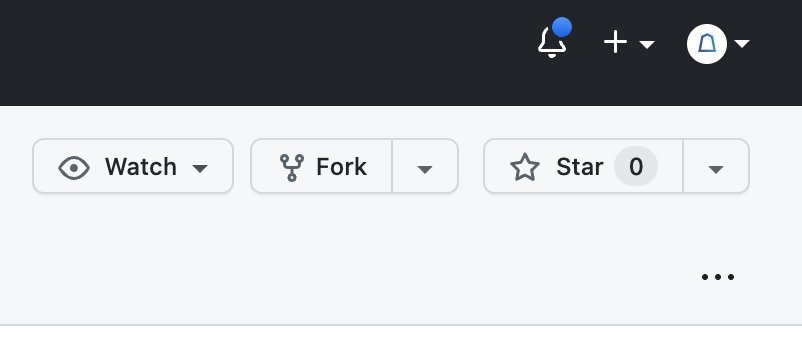

# Codespace で構築する場合の手順

## 注意

[無料で使用できる月間ストレージとコア時間](https://docs.github.com/ja/billing/managing-billing-for-github-codespaces/about-billing-for-github-codespaces#monthly-included-storage-and-core-hours-for-personal-accounts) には上限があります。
GitHub Pro アカウントの場合は 180 コア時間/月で、2 コアから選択できるので月 90 時間分に相当します。
コア時間は、Codespace が Active 状態の時間がカウントされます。
Codespace の状態は[github.com/codespaces](https://github.com/codespaces)から確認、管理できます。
Active な Codespace は以下のいずれかの方法で停止できます。

- VSCode または Browser Codespace: 左下の`><`アイコン > `Stop Current Codespace` を選択する
- [github.com/codespaces](https://github.com/codespaces) にアクセスし、Active な Codespace の三点リーダ`...`から `Stop Codespace`を選択する

## Requirements

以下がインストール済みであること。

- VSCode
- VSCode 拡張機能 [Remote Development](https://marketplace.visualstudio.com/items?itemName=ms-vscode-remote.vscode-remote-extensionpack)
- Codespaces 対応ブラウザ（Chromium 系、firefox、safari）
- VSCode で GitHub アカウントにログイン済み
  - VSCode サイドバーのアイコンからログインできる

## 手順

- [branch 構成](README.md#branch-構成)から、使用したい branch を選択する
- 選択した branch でリポジトリを fork する

  - リポジトリページの右上の `Fork` ボタン押下

    

  - 適当なリポジトリ名を設定して `Create fork` ボタン押下

- fork したリポジトリで Codespace を作成する

  - `<>` ボタン > `Codespaces` タブ > `＋` ボタン押下

    

  - codespace 用のウィンドウが開かれ、ビルドが始まる
  - ビルドが完了すると、ブラウザ上で VSCode が起動する

- 準備完了。これで論文執筆できる
- さらに、ブラウザではなく VSCode で編集したい場合は

  - VSCode の画面左下の `><`アイコン > `Connect to Codespace` から fork した Codespace を選択する

    <.png"/>
